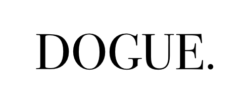
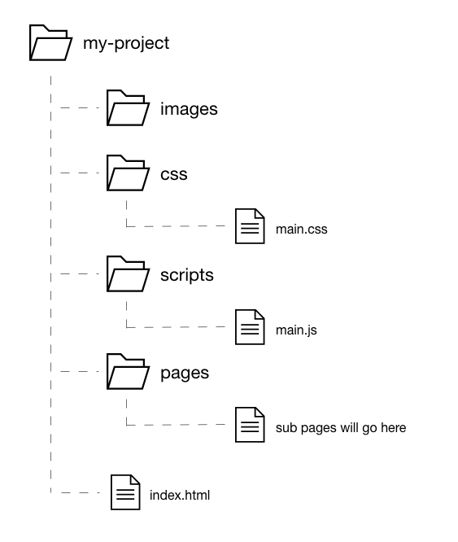

# My Project

## 1. Introduction



"Dogue." is a high-end/luxury dog fashion website. 

The site is responsive, follows a minimalist design trend and was created using a mobile-first approach. The site was developed using HTML5, CSS3 and Javascript and has 6 pages; a landing page, product page, blog page, contact page, accessories page and a meet the designers page. The site utilises simplicity, a minimal colour palette and plenty of whitespace. The site aims to solve the issue of a lack of luxury dog fashion available online. 


## 2. Coding Style Guide


### 2.1 General Rules

#### 2.1.1 Folder and File Structures



#### 2.1.2 Separation of Documents

Keep the structure, presentation and behaviour (HTML, CSS and Javascript) seperate to ensure
code is readable and maintainable. 

```html
<!-- Not recommended -->
<html>
    <body>

        <h1 style="color:red;text-align:center;">Heading</h1>
        <p style="color:green;">Paragraph.</p>

    </body>
</html>
```

```html
<!-- Recommended -->
<!DOCTYPE html>
<html lang="en">
<head>
    <link rel="stylesheet" href="main.css">
    <script src="scripts.js"></script>
</head>
```

#### 2.1.3 Capitalization

All code has to be lowercase, with the exception of strings. This applies to both HTML and CSS.

```html
<!-- Not recommended -->
<A HREF="#">This is a link</A>
```

```html
<!-- Recommended -->
<a href="#">This is a link</a>
```


### 2.2 HTML

#### 2.2.1 Indentation

For readability purposes, an element within another element (child elements) should be indented one tab space each time.

```html
<body>
    <header>
        <h1>Example Heading</h1>
    </header>
</body>
```

However, if the line is understandable then child elements don't always have to be indented.

```html
<nav>
  <ul>
    <li><a href="#">List item 1</a></li>
    <li><a href="#">List item 2</a></li>
    <li><a href="#">List item 3</a></li>
  </ul>
</nav>
```

#### 2.2.2 Encoding

Use and declare the UTF-8 character encoding in HTML templates. 

```html
<meta charset="UTF-8">
```

#### 2.2.3 Comments 

Aim to use comments as often as possible to explain code.

```html
<!-- Nav Bar -->
<nav>
    <ul>
        <li>List item</li>
    </ul>
</nav>
```

#### 2.2.4 Document Type

Use HTML5.

```html
<!DOCTYPE html>
```

#### 2.2.5 HTML Validity 

Where possible, use valid HTML. Always use the 
[W3C Markup Validation Service](https://validator.w3.org) to test if HTML is valid. 

#### 2.2.6 Semantics 

Use semantic HTML to give meaning to the web page rather than for presentation purposes.
Ensure elements are used according to their purpose.

#### 2.2.7 Alternative Content 

For accessibility purposes, always provide alternative access to multimedia such as images and 
videos. Ensure the alternative text is descriptive.

```html
<!-- Not recommended -->

```

```html
<!-- Recommended -->

```

#### 2.2.8 Line Wrapping

Wrap long lines to improve readability. Indent each new line by one tab space.

```html
<p>Lorem, ipsum dolor sit amet consectetur adipisicing elit. Nobis 
    exercitationem ipsam ipsa molestiae deserunt, vel impedit cupiditate 
    dolore quidem necessitatibus dolorum dignissimos</p>  
```

#### 2.2.9 Quotation Marks

Use double quotation marks for attribute values.

```html
<!-- Not recommended -->
<section class='main'></section>
```

```html
<!-- Recommended -->
<section class="main"></section>
```


### 2.3 CSS 

#### 2.3.1 CSS Validity

Where possible, use valid CSS. Always use the 
[W3C CSS Validation Service](http://jigsaw.w3.org/css-validator/) to test if CSS is valid. 

#### 2.3.2 IDs & Classes

ID and class names should be specific and consider the purpose of the element. 
Avoid presentational or meaningless names. Generic names should be used when an element has
no particular purpose. 

```css
/* Not recommended */
.class1
#red-button
```

```css
/* Recommended */
.image
#carousel
```
Names should be as short as possible but as long as necessary to ensure they are understandable
yet efficient. 
Seperate words used in IDs and classes with a hyphen. 

```css
/* Not recommended */
.mainimage
#navigation
```

```css
/* Recommended */
.main-image
#nav
```


#### 2.3.3 0 Values 

Units should not be specified after a 0 unless it is required. 

```css
/* Not recommended */
margin: 0px;
```

```css
/* Recommended */
margin: 0;
```

#### 2.3.4 Hexadecimals 

Where possible, use the 3 digit shorthand hexademical notation instead of the 6 digit notation.

```css
/* Not recommended */
color: #ffcc00;
```

```css
/* Recommended */
color: #fc0;
```

#### 2.3.5 Indentation 

Indent block content by one tab space to improve readability.

```css
/* Not recommended */
.section {
font-family: Arial, Helvetica, sans-serif;
color: #000;
}
```

```css
/* Recommended */
.section {
    font-family: Arial, Helvetica, sans-serif;
    color: #000;
}
```

#### 2.3.6 Declaration Stops and Spacing

End each declaration with a semicolon. 

```css
/* Not recommended */
h1 {
    color: #fff;
    font-style: italic
}
```

```css
/* Recommended */
h1 {
    color: #fff;
    font-style: italic;
}
```

Include a space between each selector and declaration block.

```css
/* Not recommended */
h1{
    color: #fff;
    font-style: italic;
}

/* Not recommended */
h1
{
    color: #fff;
    font-style: italic;
}
```

```css
/* Recommended */
h1 {
    color: #fff;
    font-style: italic;
}
```

#### 2.3.7 Property Name Stops and Spacing

Use a colon after each property name, followed by a space. 

```css
/* Not recommended */
p {
    padding:10px;
}
```

```css
/* Recommended */
p {
    padding: 10px;
}
```

#### 2.3.8 Rule Separation

Always seperate rules with a blank line.

```css
h1 {
    color: #fff;
}

p {
    padding: 10px;
}
```

#### 2.3.9 Quotation Marks

Use single rather than double quotation marks for property values.

```css
/* Not recommended */
font-family: "Roboto", sans-serif;
```

```css
/* Recommended */
font-family: 'Roboto', sans-serif;
```

#### 2.3.10 Comments

Use comments where necessary to explain code.

```css
/* Header */

/* Navigation */

/* Footer */
```

### 2.4 Javascript

#### 2.4.1 Naming

Use camelCase when naming variables and functions.

```javascript
firstName = "Jasmine";
lastName = "Harwood";
```
#### 2.4.2 Indentation

Use one tab space when indenting code blocks.

```javascript
function myFunction(a, b) {
  return a + b;
}
```

#### 2.4.3 Statement Rules

Put the opening bracket at the end of the first line with one space before it. Place the closing bracket on a new line.

```javascript
function testFunction(number) {
  return number * number;
}
```

#### 2.4.4 Statement Stops

Use a semicolon at the end of simple statements.

```javascript
var x = myFunction(1, 8);
```

#### 2.4.5 Object Rules

Place the opening bracket on the first line with a space beforehand. After each property use
a colon, followed by a space and then the value. Use quotation marks for strings, not numerical
values. Seperate each property/value with a comma but do not place a comma after the last property/value. Place the closing bracket on a new line and end with a semicolon. 

```javascript
var person = {
  firstName: "Jasmine",
  lastName: "Harwood",
  age: 22,
  eyeColor: "blue"
};
```