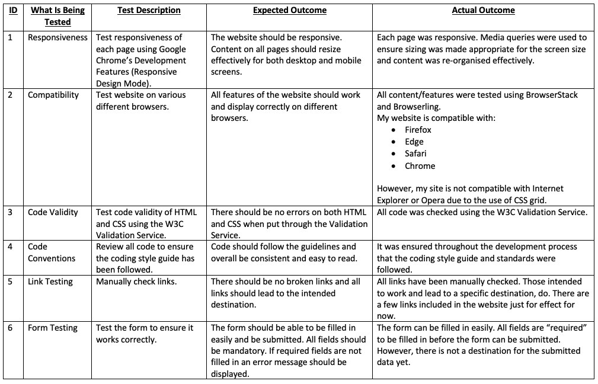
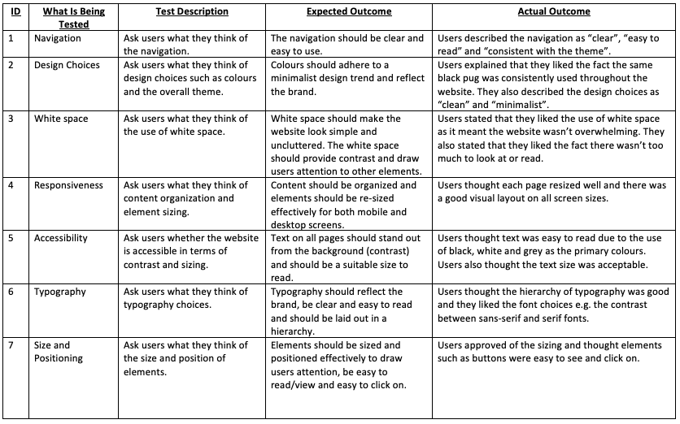

## Technical Test Plan

A technical test plan was devised before the start of this project which set out the areas to be tested;

- The responiveness of the website on different screen sizes 
- The compatibility, how the website looks on different broswers
- Code validity of HTML and CSS using the W3C Validation Service
- Code conventions, ensuring the style guide has been adhered to
- Link testing
- Form testing

After the project was finished, all areas were tested and the plan was completed.

## User Test Plan

A user test plan was also created before the start of the project which set out areas to test/gain feedback on. These areas included;

- Navigation
- Design choices e.g. colours and the overall theme
- Use of white space
- Responsiveness, how content was re-organised and re-sized
- Accessibility, e.g. was text easy to read?
- Typography
- Size and positioning of elements e.g. images and buttons.

Once the project was completed, 5 users were shown the website and asked for feedback on these different areas.

