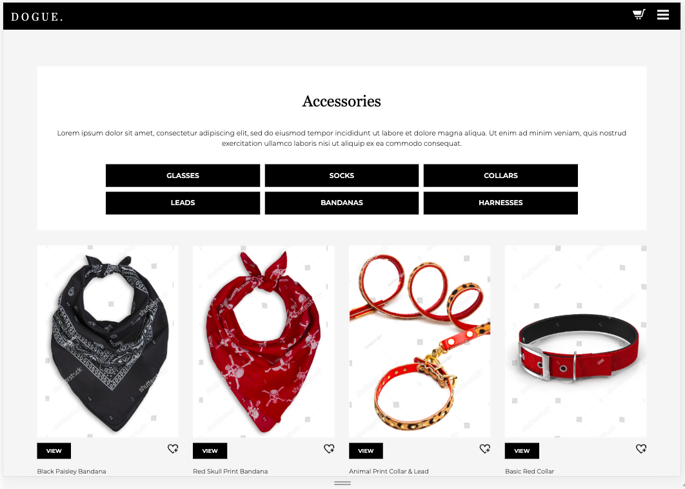
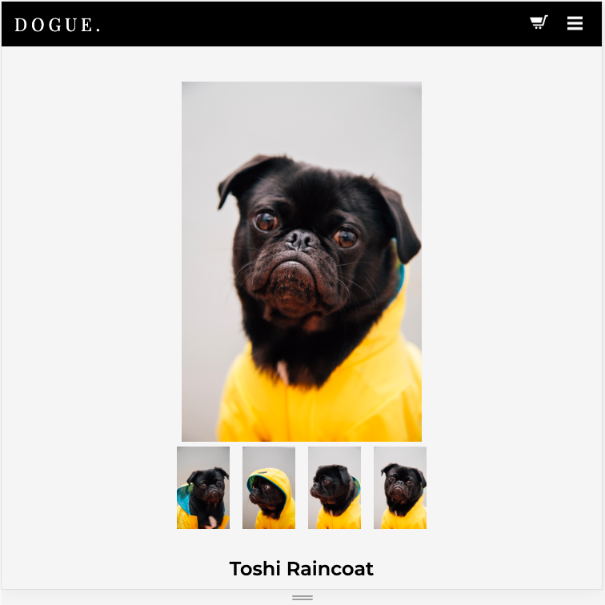

# Viewport Size Examples

My website was made responsive for desktop (1400px), tablet (less than 750px) and mobile (less than 500px) screens using media queries. Google Developer Tools were used throughout the process to test responsiveness.

## Home Page

### Desktop

### Tablet

### Mobile 

## Accessories Page

### Desktop

### Tablet

### Mobile 

## Blog Page

### Desktop

### Tablet

### Mobile 

## Contact Page

### Desktop

### Tablet

### Mobile 

## Meet The Designers Page

### Desktop

### Tablet

### Mobile 

## Product Page

### Desktop

### Tablet

### Mobile 

